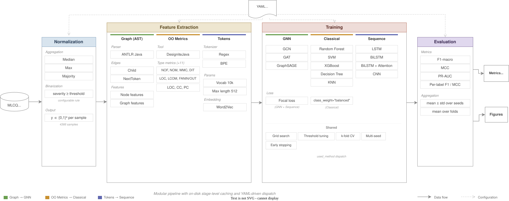

# MLCQ-Graphs

This is the reproduction package for our IST paper on code smell detection. It wraps three model families (classical ML on OO metrics, sequence DL on token sequences, GNNs on AST graphs) behind a single entry point so that preprocessing, label definitions and evaluation are identical across all experiments. Everything is driven by YAML config files.

The dataset is MLCQ (4366 Java samples, 4 smells). We do not redistribute it; get it from the [original repository](https://github.com/tudo-aqua/MLCQ).



## Setup

```bash
git clone <repo-url> && cd mlcq-graphs
uv sync
```

You need Python 3.13+, Java 17+ (for DesigniteJava) and [uv](https://docs.astral.sh/uv/). Place the MLCQ JSON at `data/MLCQCodeSmellSamples.json`.

## Reproducing the paper results

Each experiment is one command. The pipeline caches intermediate stages (normalization, metric extraction, tokenization) so only the first run per family pays the full cost.

### Step 1: Classical ML (5 models, ~25 min total)

```bash
for model in rf svm xgboost dt knn; do
  uv run python main.py --config config/experiments/classical_${model}_pipeline.yml
done
```

This runs DesigniteJava to extract 21 OO metrics, then trains each model with 5-fold stratified CV, grid search over hyperparameters, and per-label threshold tuning. Results go to `artifacts/runs/<fingerprint>/<model>_results.json`.

### Step 2: Sequence DL (4 models, ~1h on GPU)

```bash
for model in lstm bilstm bilstm_plain cnn; do
  uv run python main.py --config config/experiments/sequence_${model}_pipeline.yml
done
```

Tokenizes code with a regex splitter (vocab 10k, max length 512), trains with focal loss and early stopping. GPU recommended; falls back to CPU.

### Step 3: GNN (3 architectures)

```bash
uv run python main.py --config config/experiments/gcn_baseline.yml
```

Parses each snippet into an AST with ANTLR Java 8, builds PyTorch Geometric graphs with Child edges and 69-dim node features (64-dim type embedding + 5 numeric), trains with focal loss. it actually does an ablation with the 3 architectures. 

### Step 4: Generate figures and tables

```bash
uv run python scripts/report_runs.py --artifacts-root artifacts
uv run python scripts/plot_confusion_matrices.py --artifacts-root artifacts
```

## Changing things

Any YAML key can be overridden from the command line. The pipeline re-runs only the stages affected by the change.

```bash
# Train LSTM with a larger hidden layer and only 2 seeds
uv run python main.py --config config/experiments/sequence_lstm_pipeline.yml \
  '--training.model_params.hidden_dim=256' \
  '--training.seeds=[42,43]'

# Try XGBoost with a custom grid
uv run python main.py --config config/experiments/classical_xgboost_pipeline.yml \
  '--training.param_grid.n_estimators=[50,100,500]' \
  '--training.param_grid.max_depth=[3,5,10]'

# Run GCN with 3 GNN layers instead of 2
uv run python main.py --config config/experiments/gcn_baseline.yml \
  '--training.num_layers=3'

# Force rebuild everything (ignore cache)
uv run python main.py --config config/experiments/classical_rf_pipeline.yml \
  '--run.force_rebuild=true'

# Switch binarization rule to match Madeyski DS1 (major+critical only)
uv run python main.py --config config/experiments/classical_rf_pipeline.yml \
  '--normalization.rule=madeyskiDS1'
```

Config files inherit from `config/defaults.yml`. Look there for the full list of parameters.

## What each stage does

**Normalization** -- Aggregates multi-reviewer MLCQ annotations into binary labels. Default: median severity, positive if severity > none. Supports Madeyski DS1/DS2 rules via `--normalization.rule`.

**Metric extraction** -- Runs DesigniteJava in batches to extract 11 type-level metrics (NOF, NOM, WMC, DIT, LCOM, FANIN, FANOUT, ...) and 3 method-level metrics (LOC, CC, PC) aggregated by max/sum/avg, plus method count. 21 features total.

**Token dataset** -- Regex tokenizer splits code into identifiers, keywords, operators, literals. Builds vocabulary from training data, pads/truncates to fixed length. Optional Word2Vec pre-training.

**AST construction** -- ANTLR Java 8 grammar parses each snippet (wrapped in a synthetic class) into a syntax tree. 202 node types. Exports as DOT files, then converted to PyTorch Geometric Data objects.

**Training** -- Dispatches to the right training script based on `training.used_method` (classical, sequence, gnn). All share: multi-seed evaluation, per-label threshold tuning, imbalance-aware losses.

**Caching** -- Each stage computes a SHA-256 fingerprint from its inputs and config. If the fingerprint matches a previous run, the stage is skipped. This means switching between models in the same family is fast (normalization and feature extraction are reused).

## What we plan to do next

We are working on integrating [DaCoSX](https://github.com/nicedaycode/DaCoSX) as an alternative dataset to test generalization beyond MLCQ. We also want to run a more systematic comparison of imbalance-handling strategies (focal loss vs asymmetric loss vs class-weighted BCE vs SMOTE) since different losses can shift per-smell performance substantially and the current setup only scratches the surface.

## Project structure

```
main.py                             # entry point
config/
  defaults.yml                      # all default parameters
  experiments/                      # one YAML per experiment
mlcq_graphs/
  pipeline.py                      # stage orchestrator + caching
  models/                          # classical.py, sequence.py, gcn.py, gat.py, graphsage.py
  training/                        # focal loss ( weighted BCE, ASL // not yet used)
  evaluation/                      # F1, MCC, PR-AUC, threshold tuning
scripts/
  NormalizeFromJson.py              # reviewer aggregation + binarization
  extract_designite_metrics.py      # batched DesigniteJava
  build_token_dataset.py            # tokenizer
  build_ast_dot_from_normalized.py  # ANTLR parsing
  build_pyg_dataset_from_dot.py     # DOT to PyG
  train_classical.py                # sklearn training
  train_sequence.py                 # PyTorch sequence training
  report_runs.py                    # tables + figures
tools/
  designite.jar                     # metric extraction
  antlr/                            # Java 8 grammar
data/
  MLCQCodeSmellSamples.json         # MLCQ (not redistributed)
artifacts/                          # outputs (gitignored)
```

## License

See LICENSE file.
